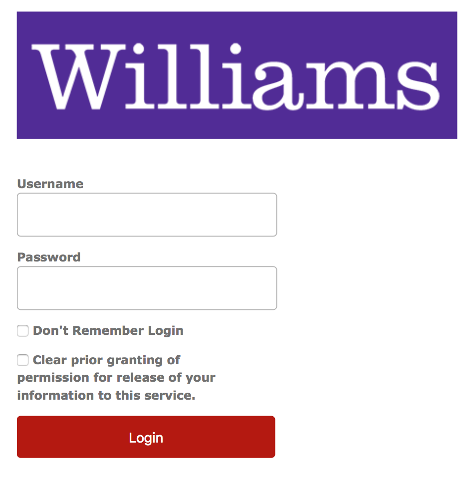
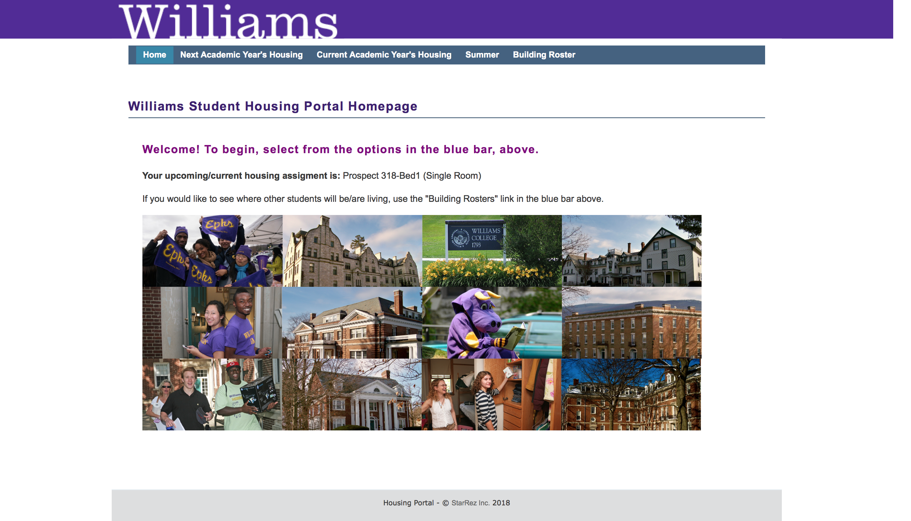
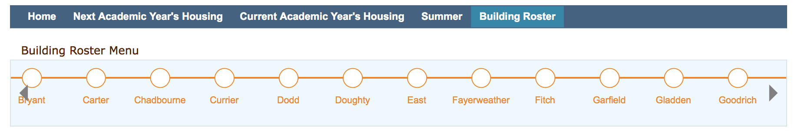

When we follow the link to the Williams college housing portal we are welcomed by the following screen. The link to the actual information that is requried from this site has the smallest font and is barely visible

The login page which could have been placed instead of the initial link is as follows: 

After logging in, in the building roster option we are only able to move through buildings by hovering over the slider. There are no searching features or abilities to slide faster if we choose to do so. 

