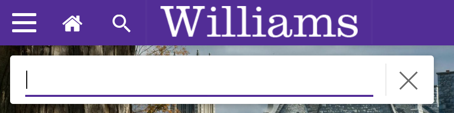
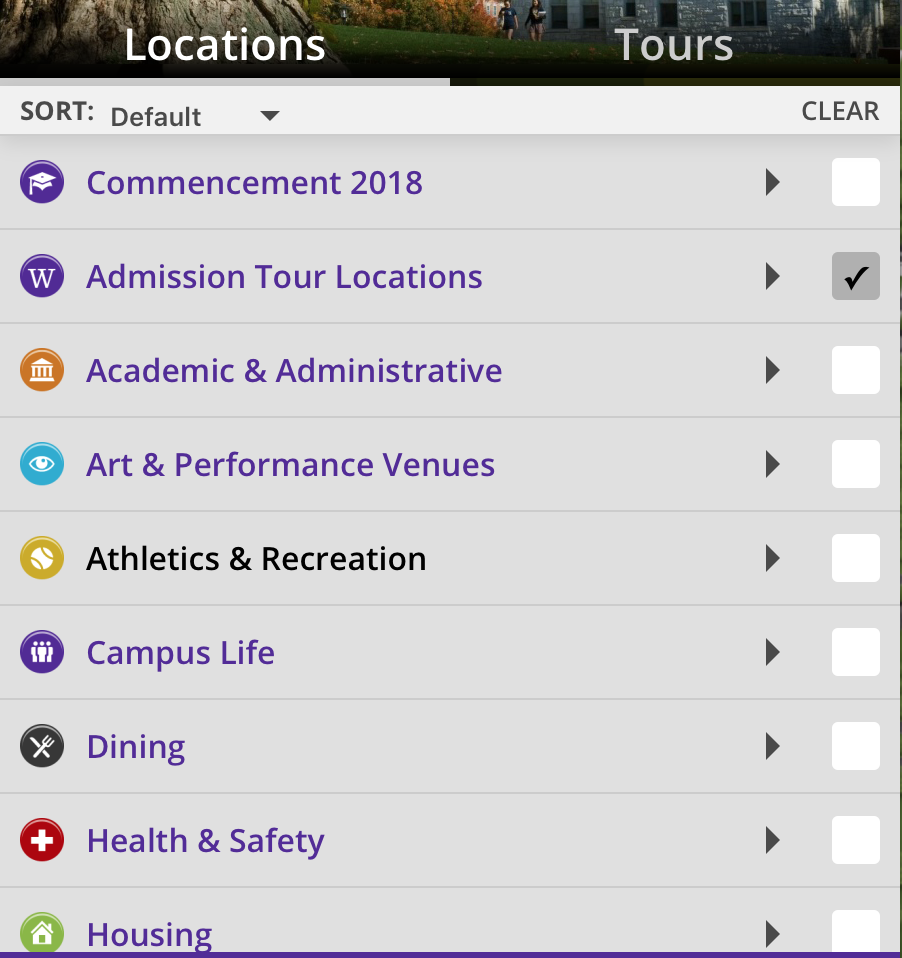

As soon as we open the map we are given a bird’s eye view of the entire campus which would allow us to easily locate and zoom into the place we want to go. 

there are clear signifiers to the affordances of the site. There is a clearly visible search signifier via the magnifying glass. 

There is a printer icon on the top right signifying the possibility of printing a document. There are zoom in and zoom out buttons clearly shown using the + and - symbols. 

The navigation pane on the left is also very intuitive in terms of showing a checked Williams Admission Tour Locations and the 

What norman said about being able to predict is seen here. There is clearly a very good concept. in this site. 

One minor edit that could be added to this site is the possibility to change the orientation of the map depending on where one needs to go. Having backwards on a map while actually walking forward in a mirror image world is not always easy, but just as Norman illustrated with by mentioning boats and wheelchairs, There is definitely some intuition to navigating in such an environment. 
