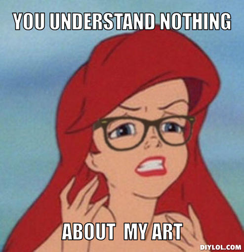

**Motivation**

A lot of Museum goers have trouble understanding artworks and appreciating them beyond their visual appeal. Artists create a piece to convey a certain message and more often than not these messages get lost in translation. While there is some beauty to people bringing their own interpretations to the Museum gallery, there are numerous others who would love to know more about the artworks than the 4 to 5 lines that are presented beneath the title of a piece. 

**Solution**

Artsplainer is an app that gives you notifications about art pieces that you have been looking at for a given amount of time. The threshold beyond which you want to recieve notifications can be manually set at the beginning of your museum visit. 
You can set how much detail you want to be included. 
There could be small motion sensors in front of Artwork or geo spatial tagging that can be triggered once a person has been standing continuously in front of an image for a long enough amount of time. The person can then receive a notification telling them more about the piece they were just seeing. To make things more interactive, the user will first be prompted by what they think the images meant and then given the option to get the meaning attached to the painting by the artist. 
